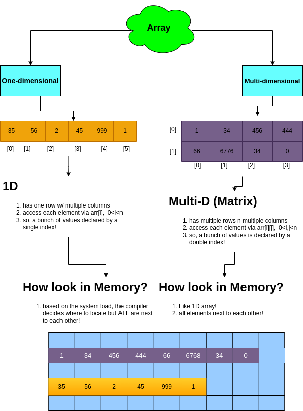
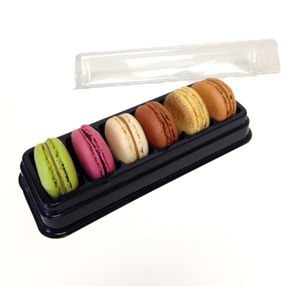
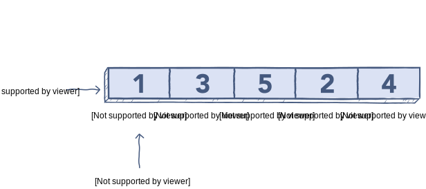

# Arrays in Python

# Array
- Pretty similar to this box of Macarons!
- The box(~array) has fixed size n cannot be changed!
- Each macaron is accessible due to its unique location(~green—>4th one)
- Box is produced only for storing macarons! (cannot include Puffine)
- Macarons are next to each other without any gap!

 

- Array can store of specified type!(~if ya create an array of integers, ya cannot insert a string!)
- Elements of the array are next to each other in the memory(no gap!)
- Each element of array has unique index!(~access element 42, arr[2])
- Size of array is predefined n cannot be changed! When we define its capacity!

# What is array in CS?
- Collection of elements, each identified by at least one index or key! The position of each element can be find by its index!

# Arrays in Memory?
- Compiler decides to allocate cells in memory to it!
2D similar to 1D
# How to create an Array?
- Pretty efficient in accessing the elements BC they all are stored in a contiguous way(nxt to each other!)
- All the cells will be reserved in memory once ya define the size!
- Recommended when ya know the number of elements ya wanna use! Since the cells will be reserved!
# What does traverse in Array mean?
- visiting ALL cells of the array till the end!
**How?** Simply create a loop n start looking at each cell!
# When to use/avoid Array?
- Use:
    - To store multiple variable of “same” data type
Random access(cuz we have the index)
- Avoid:
    - Same data type elements
    - Reserve cell in memory!

