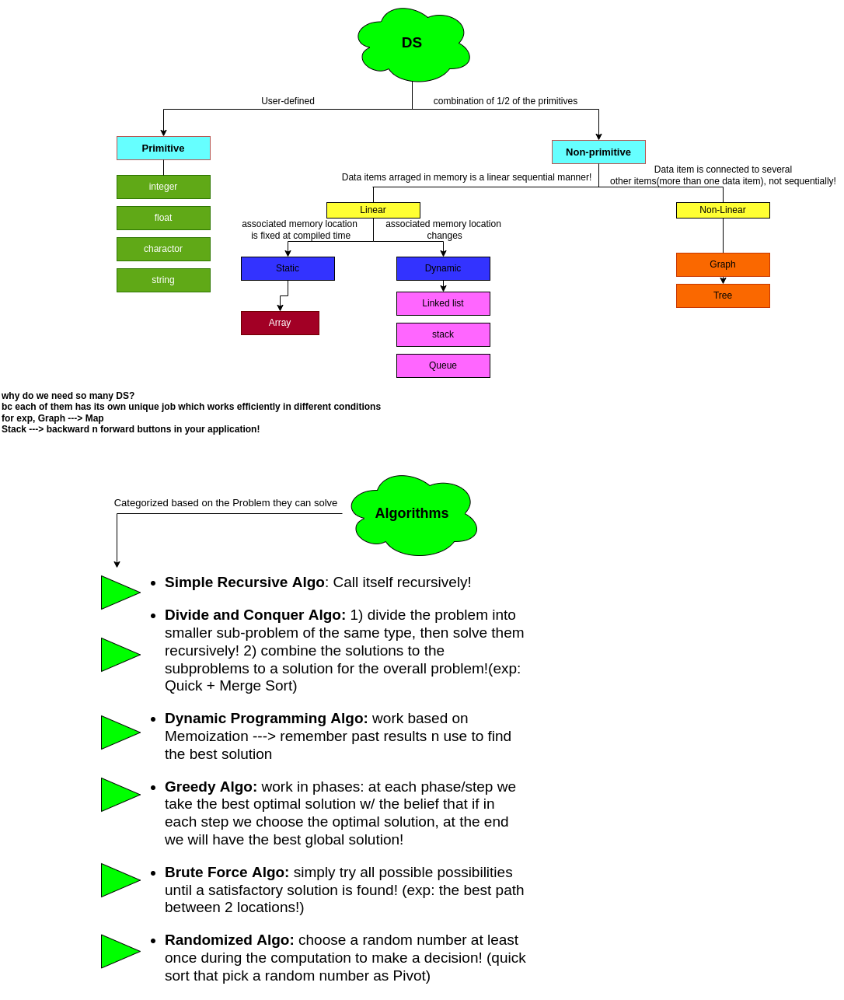

# Data-Structure-and-Algorithms-in-Python

# DS
Different ways of organizing data in your computer to be used later in an effective way! (how do they organized n group together and stored during program execution!)
