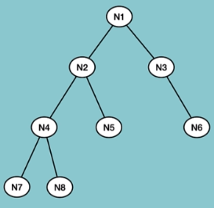
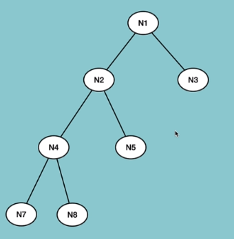
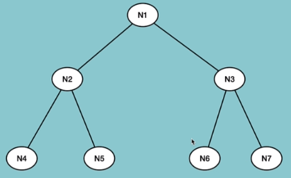
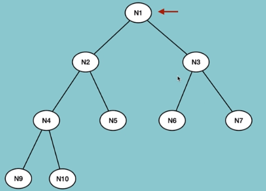
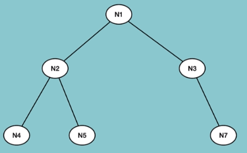

## Type of tree:

- **Binary Tree**

    

    - Each node has at most 2 children, could be one but no more than 2
    - Binary Search Tree used for it!

    **Type of BT**

    - **Full BT** ---> each node has either Zero or 2 children!
    

    - **Perfect BT** ----> each node has 2 children + same level
    

    - **Complete BT** ----> all level has filled except the last level!
    

    - **Balanced BT** ----> all leafs are at the same distance from root
    

    ## Operations on Tree
    - Insert a node
    - Delete a Node 
    - Search for a value
    - Traverse all nodes
    - Deletion of a tree

    ## Traversal within a Tree
    
    - **BFS**
        - InOrder
        - PreOrder
        - PostOrder
    - **DFS**
        - LevelOrder