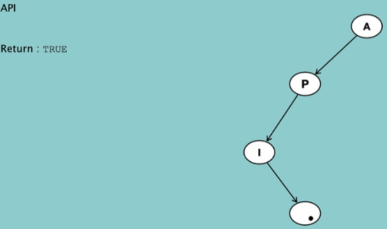
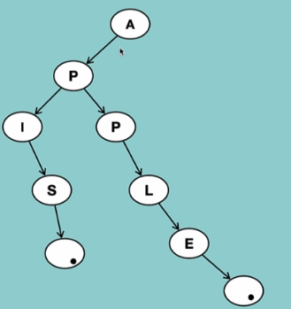

# Tree  🌳🌲🌵🌴

- # Binary Tree 🌵

    

    - Each node has at most 2 children, could be one but no more than 2
    - Binary Search Tree used for it!

    **Type of BT**

    - **Full BT** ---> each node has either Zero or 2 children!
    

    - **Perfect BT** ----> each node has 2 children + same level
    

    - **Complete BT** ----> all level has filled except the last level!
    

    - **Balanced BT** ----> all leafs are at the same distance from root
    

    ## Operations on Tree
    - Insert a node
    - Delete a Node 
    - Search for a value
    - Traverse all nodes
    - Deletion of a tree

    ## Traversal within a Tree
    
    - **DFS**
        - InOrder
        - PreOrder
        - PostOrder
    - **BFS**
        - LevelOrder
    
## Pre-order Traversal


**Root Node ----> Left SubTree ----> Right Subtree**

- the last node that we visit is almost always is the right ending leaf node.

## In-order Traversal


**Left SubTree ----> Root Node ----> Right Subtree**

- the last node that we visit is almost always is the right ending leaf node.

## Post-order Traversal


**Left SubTree ----> Right SubTree ----> Root Node**

- the last node that we visit is almost always is the root node.

## Level-order Traversal

- **Level-order Traversal Usage**
    - Search for a Value
    - Insert a Node
    - Delete a Node


**Level1 ----> level2 ----> ...**

- In each level, we start from the leftmost node and end at the rightmost node.
- **Search:** When we wanna search for a node in a tree, we usually use **level-order traversal** cuz it uses Queue not like the others that uses Stack! 

- **Insert:** When ya wanna insert a node, we usually use **level-order traversal**. So now the question is **HOW** to find a place to add the node? The answer is pretty simple! the place will be the very first empty option we see! In other words, we go in each level, check whether its node has 2 children, if yes, then it is not possible to add the node there, then we go to the next node check whether it has one child, if yes, then it is not possible to add the node there, then we go to the next node and so on.


- **Delete:** We usually use **Level-Order Traversal** We have 2 Scenarios:
    - 1. The node.value we wanna delete does not exist in the tree! --> return false
    - 2. The node we wanna delete exists in the tree! If yes, then we need to do some stuff:
            - Find the deepest node in the tree.
            - Swap the value of the node we wanna delete with the deepest node.
            - Delete the deepest node.
            - You ask **why? why not deleting the node itself?** This is bc in a tree, the next nodes rely on the prev node! So we cant really delete it as if we do so, then in breaks the connections! So we need to swap the value of the node we wanna delete with the deepest node, and then delete the deepest node.


# Binary Search Tree 🌵
- left nodes are less than the root + right node!

    - **Search:** The methodology is pretty simple! ya start by the root, compare the target value with the root value, if the target value is less than the root value, then we go to the left node, if the target value is greater than the root value, then we go to the right node.
    - **Delete:** 
        - If the node we wanna delete is a leaf node, then we can just delete straightaway!
        - If the node we wanna delete has only one child, then we can just delete it and replace it with the child.
        - If the node we wanna delete has 2 children, then we need to find the deepest node in the left subtree and swap the value with the node we wanna delete.**(i.e. Succesor; the smallest node in the right subtree)**
        - If the node we wanna delete has 2 children, then we need to find the deepest node in the right subtree and swap the value with the node we wanna delete.

# AVL Tree 🌵
- **AVL Tree** is a type of **Binary Search Tree** that is balanced.
- Why we need it ? look at the img below;


So, how can we balance the tree? We can get rid of the unbalanced nodes by doing some **rotations**!
But how do we know which tree needs to be rotated? We can use the **height** of the tree!
The idea is pretty simple; if the difference between the height of left subtree and the right subtree is greater than 1, then we need to rotate the tree.
## Balanced AVL


## Dis-balanced AVL


We can solve such a problem by doing some **Rotations**!

## Insertion in AVL

First we need to figure whether we need to rotate the tree or not.

- **Case1:** Rotation is not required:
When the tree is balanced, then we dont need to rotate the tree(i.e. difference height subtrees equal to 1). So we treat it same as BST; 
    - 1.Compare w/ the root to go right/left!
    - 2.Insert at the first empty spot! 

- **Case2:** Rotation is required: 
When the tree is unbalanced, then Rotation is required!


- **Left left condition:**
    - 1. Rotate right
    - 2. Update the height of the tree
- **Right right condition:**
    - 1. Rotate left
    - 2. Update the height of the tree
- **Left right condition:**
    - 1. Rotate left the child of the root then rotate right the root
    - 2. Update the height of the tree
- **Right left condition:**
    - 1. Rotate right
    - 2. Update the height of the tree

### What does left left condition mean?
So imagine in the following img, we wanna insert a node with value of 10. 
- We start by comparing from the root node, if the value of the root node is greater than 10, then we go to the left subtree, if the value of the root node is less than 10, then we go to the right subtree.
- Once we find the right place to insert the node, then we insert it!
- Now we start with the node we just inserted, all the way up to the root node, we need to check if the height of the subtrees are balanced or not. To find the node that is causing the unbalance. then we need to find the condition (node 30 in our case)

    - If the height of the subtrees are balanced, then we dont need to rotate the tree.
    - If the height of the subtrees are not balanced, then we need to rotate the tree. 
Once we find the unbalanced node, then we go and check which subtree is causing the unbalance.)
    - If the left subtree is causing the unbalance, then we need to rotate the tree to the right. (20-10 our case)
        - **right rotation:** 
            - Root node comes down then the left subtree comes up.
            
    - If the right subtree is causing the unbalance, then we need to rotate the tree to the left.

## Summary of Left Left Condition Rotation:
- Find the unbalanced node, then find the condition
- Find the condition of the unbalanced node 
- Find the grand child of this unbalanced node + the path to its grand child node
- Once found,then how to know which child to select?
    - the one that has more height!
- Once found, then Rotate Right!


## Left Right Condition
- Find the disbalanced node
- Find the Condition, How? next bullet! 😁
- Find the grand child of the node + the path to the grand child node!
- Once found, then first, rotate the left child of the disballenced node to left(i.e. move the right child of the parent to parent place) ---> Left rotation for the left child of the disballenced node!


## Right Right Condition ---> Do rotation to the left for the disballenced node!
- Find the disbalanced node( move upward and compare the difference in height)
- Find the Condition, **How?** next bullet! 😁
- Find the grand child of the node + the path to the grand child node!
- Once found,rotate to left!


## Right Left Condition ---> Right rotation for the right child of the disballenced node! then Left rotation for the disballenced node!

    


# Binary Heap 🌵🗻
- **Binary Heap** is a type of **Binary Tree** that is ordered.
- **Min Heap:** The root node is the **smallest** value in the tree; The value of the children nodes are greater/equal than the value of the parent node.
- **Max Heap:** The root node is the **largest** value in the tree; The value of the children nodes are less/equal than the value of the parent node.
- Use Array for storage!


## Why we need Binary Heap?
- Find Smallest/Largest element in the array!
- Insert element in the array in O(log n) time!

## Practical Use of Heap?
- Prim's Algorithm
- Heap Sort
- Priority Queue

## Common Operations:
- **Peek Heap**: Return the root node of the heap. *Note: Root always locate at arr[1]*
- **Size of Heap:** How many nodes are there in the heap.*Note: return only the filled cells!*
- **Traverse Heap:**
    - Pre-Order Traversal
    - In-Order Traversal
    - Post-Order Traversal
    - Level-Order Traversal

## Methods
- **Heapify:**  Method for adjusting the heap to the correct order.
```
def heapifytree(root, index, heap_size):
    left = 2 * index
    right = 2 * index + 1
    largest = index
    if left <= heap_size and root[left] > root[largest]:
        largest = left
    if right <= heap_size and root[right] > root[largest]:
        largest = right
    if largest != index:
        root[largest], root[index] = root[index], root[largest]
        heapifytree(root, largest, heap_size)

def heapify(root):
    heap_size = len(root) - 1
    for i in range(heap_size // 2, 0, -1):
        heapifytree(root, i, heap_size)

def heapify(root, index):
    heap_size = len(root) - 1 #-1 because the root is at index 1
    left = 2 * index
    right = 2 * index + 1
    largest = index
    if left <= heap_size and root[left] > root[largest]:
        largest = left
    if right <= heap_size and root[right] > root[largest]:
        largest = right
    if largest != index:
        root[largest], root[index] = root[index], root[largest]
        heapify(root, largest)
```

## Extract a Node from a Heap
- Note that we can only extract the root node!
- **Extract in Min-Heap**
    - 1. remove the root
    - 2. find the last node in the heap then swap it with the root
    - 3. heapify the tree
    - 4. **What if we have 2 child?** Then in the case of Min-Heap, we need to swap the root with the smallest child! And in Max-Heap, we need to swap the root with the largest child!

# Tries 🧾📝


- **Tries** is a tree that mostly used for **String**.
- Any node can store non-repeating characters.
- every node keep track of the end of the string. (* in the pic above!)
- Can have multiple children for each node.


## Common Operation on Tries:
- Insertion 
- Search for a String 
- Deletion of a String 

## Practical Usage in Interview
- Validation of a word
- Spell Checker
- Search for a string  
- Auto Complete

## Insert a String in Tries:


- In one node we can insert more than one charactor (I in our example)


## Search a String in a Trie:
- **Case 1:** 
    - String **does not exist** in the Trie. So we start by comparing the first character of the string with the first character of the node. If they are not equal, then we can return False.

         

- **Case 2:**
    - String **does exist** in the Trie. So we start by comparing the first character of the string with the first character of the node. If they are equal, then we need to check the rest of the string.
        - If the rest of the string is not empty, then we need to check the next node.
        - By checking, it does not mean that the string is in the Trie! We need to check whether **it is the end of the string or not**. 
            - If it is the end of the string, then we return True, else False!

        

- **Case 3:**
    - String is a prefix of another string in the Trie, which means that it does not exist! **Why?** Cuz the next node of it is not endofString!

        

## Deletion String in Tries:
- Start from the leaf node and go up to the root node!
- We need to check if the string is a prefix of another string in the node or not! I.e. Check if any node rely on this string, if so, then we can't delete it and we should do sth else! But what? 🤔

    - **Case 1: Some other prefix of string is same as the one we wanna delete!**
        - 1. Check whether the sting exist in the Trie! *Note to check the EndingSting*
        - 2. If it exist, then we start by the leaf and go one by one up to the root! Any time we check whether any node rely on this string or not! If so, we can delete it right away! (I in the below pic, Goal: Delete API, APPLE)

                

    - **Case 2: String is a Prefix to other String!**
        - 1. So for exp. in the below pic, if we wanna delete API we see that we have a headache! Cuz if we delete API, then APIS will be impacted! (S is after I; S relys on I) So what can we do? 🤔
        - 2. So in this case, we dont delete the String! Rather we just update the EndingSting of the node! So that the Trie will not recognize it as a Complete String! 

                 
                
                 


    - **Case 3: Some other Strings are the prefix of the Str we wanna delete!**

## Summary of Deletion 
- First check whether any node rely on the target node. If not, then we can delete it rightaway! If Yes, then
    - Do some adjustments, like changing the StringEndingPoint.
                 

